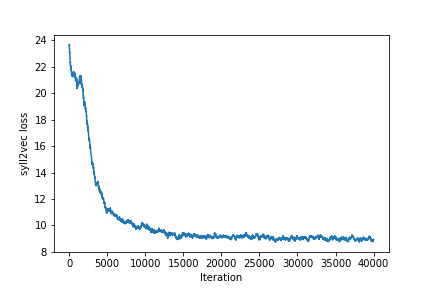
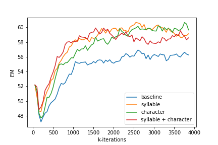
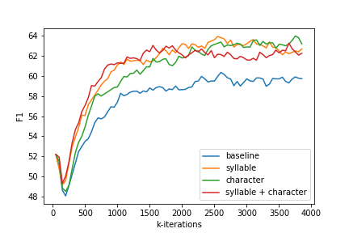
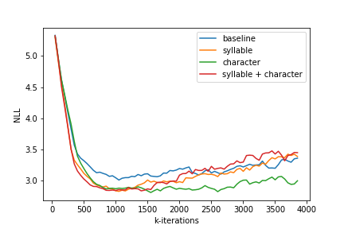

### Syll2Vec: A Phonetic Approach in Reading Comprehension

#### Key Modules
Implemented (in PyTorch) syllable embedding in a bidirectional attention flow (BiDAF) recurrent neural net.
* [Handout](writeup/DFP_Handout.pdf): instructions on how to set up environment, download datasets, and train the baseline models. 
* [layers.py](layers.py): Definition of layers for the Bi-directional Attention Flow RNN model.
* [layers_rnet.py](layers_rnet.py): Definition of layers for the R-net RNN model.
* [models.py](models.py): Definition of BiDAF and R-net models.
* [syl2vec64d](syl2vec64d/run.py): pre-train word and syllable embedding on Stanford tree sentiment dataset.
* [syllabify](syllabify/syll_prep.ipynb): transform English text to syllables.
* [train.py](train.py): training model on Stanford Question-and-Answering Dataset (SQuAD).
* [test.py](test.py): evaluating model on the testset for leaderboard submission.

To train the model, simply run on a GPU-equipped VM and (optionally) shut down the instance after training.
```bash
python3 train.py -n BiDAF_char && sudo poweroff
```

___
#### Summary
This project explores a different sub-word level embedding approach using syllables. Whereas other sub-word level approaches (e.g. n-gram) operates on language morphology, syllable embedding operates on phonemes. Because the number of possible phonemes is much lower than the number of character combination, syllable embedding are expected to shed new light on correlation between words that sound similar, but are spelled differently. In this project, a syllable embedding is trained using the same text corpus from assignment 2 that trained character embedding. The embedding was further trained on the SQuAD 2.0 dataset. The results show no significant advantage of syllable embedding over character embedding, and the two embedding do not show synergistic effect when working together.

#### Introduction
Traditionally, morphemes have been studied as the smallest semantic unit (e.g. breaking down words into stem and root). Sub-word level units are generally used to resolve the challenge of out-of-vocabulary words. Successful attempts at such endeavor includes n-grams embedding and character level embedding. The main challenges for model below the word level involve the need to handle large, open vocabulary, rich morphology, transliteration and informal spelling.

This project explores the efficacy of using phonemes as basic unit of embedding. Whereas character embedding is purely based on morphology (how letters are arranged), phoneme embedding are phonetically based (referred to as 'syllable' embedding for the rest of the report). The basic assumption for character embedding is that words that are spelled similarly should have similar meaning. The assumption for syllable embedding is that words that are made of similar sound should have similar meaning.

The hypothesis of this project is that syllabus embedding can be equally helpful in English language as in Korean, and more helpful than character embedding. The line of reasoning is that although character embedding have small vocabulary size (upper case, lowercase letters, numbers, special characters). The possible permutation is huge. The character decomposition of a word of length *n* results in *52<sup>n</sup>* possible permutation (considering upper and lower case letters only). 


In contrast, a word can be conveniently separated into syllables, and many out-of-vocabulary words are combination of reusable syllables. A long word, such as "stationary" can be broken into three-syllable "sta-tion-ary" instead of nine-letter combination. The exponent drops from 9 to 3, and the possible permutations are greatly reduced from |V<sub>c</sub>|<sup>9</sup> to |V<sub>s</sub>|<sup>3</sup> (five magnitude lower). A neural net with good learned embedding for the three syllables should learn that the vocabulary is an adjective that relates to a state (as "ary" from binary, planetary, military, and "tion" in action, condition, motion).

#### Related Works
Syllable embedding have been applied to highly agglutinative language such as Korean, which exhibits complex morphology of words that renders word embedding less effective than for less agglutinative languages. The results shows its robustness to out-of-vocabulary phrases in Korean language. In particular, an implementation of simple RNN with syllable and morphene embedding outperformed the character level embedding counterpart by 16.87 perplexity with 9.5 million parameters, on a prediction task in Korean language. 

While Korean language has wide variety of possible agglutinations possible, English language is more regular morphology, with cleanly separated word and character. In English-related NLP works, syllables were studied in speech translation task, but not in text comprehension task.

___
#### Approach
Initially, the baseline model is intended to be the R-net model, using word embedding and character embedding. Another baseline is the bidirectional attention flow model, also using word embedding and character embedding. These baselines are compared to the performance of syllable embedding and word embedding. The F1 and EM metrics are used to evaluate performance, as required by the leaderboard.

The syllables are extracted using a syllabify module which depends on the CMU Pronouncing Dictionary of North American English word pronunciations. The module is simplified to ignore stress on vowel, and original implementation of symbolizing syllable as short 3~4 character string is integrated into the module. 

The syllabify module is applied to the text sentences corpus dataset from assignment two. The dataset contains 11855 sentences with sentiment scores. The same methodology of word2vec is applied to learn syllable embedding with negative sampling. The overall process can be seen as breaking every word into smaller, more modular words that represent its sound, instead of its spelling. Each English word maps to at least one syllable, just as each English word maps to at least one character.

After extracting syllables, syllables are indexed and have embedding randomly initialized. The word2vec model is applied to train syllable embedding. Afterward, the syllable embedding is incorporated into the SQuAD starter code, and loaded along with word embedding. The embedding is further fine-tuned during the SQuAD training process.


*Source sentence 1:*
> Steers turns in a snappy screenplay that curls at the edges ; it 's so clever you want to hate it .

*Syllabified sentence 1:*
> stihrz ternz ihn ah snae piy skriyn pley dhaet kerlz aet dhah eh jhahz ; iht ehs sow kleh ver yuw waant tuw hheyt iht .

*Source sentence 2:*
> What really surprises about Wisegirls is its low-key quality and genuine tenderness .

*Syllabified sentence 2:*
> waht rih liy ser pray zihz ah bawt wisegirls ihz ihts low-key kwaa lah tiy ahnd jheh nyah wahn tehn der nahs .

*Source sentence 3:*
> The film provides some great insight into the neurotic mindset of all comics -- even those who have reached the absolute top of the game .

*Syllabified sentence 3:*
> dhah fihlm prah vaydz sahm greyt ihn sayt ihn tuw dhah nuh raa tihk maynd seht ahv aol kaa mihks -- iy vihn dhowz hhuw hhaev riycht dhah aeb sah luwt taap ahv dhah geym .

The syllable embedding is taken as input by a bidirectional LSTM unit, and the hidden states are taken as the syllable-based word embedding, and are concatenated with the pre-trained word embedding. The concatenated embedding is passed through a projection layer, a high-way layer, and encoded by a RNN encoder to acquire the preliminary representation of the original paragraph and question. Then depending on the model characteristic, different branches are used. 

#### BiDAF model
For the BiDAF model, the context and question representation are taken as input by the BiDAF attention layer, and finally predictions are generated by the output layer. The attention layer computes direction in both direction: context-aware question representation and question-aware context representation. The output layer applies a linear transformation, which is followed by a softmax layer to compute the starting pointer, and a bidirectional LSTM to compute the ending pointer. 

___
#### Experiment
Out of the original sentences dataset, a total number of 21701 distinct words were found. After transforming into syllables, a total of 5524 syllables were found, resulting in 74.54% compression rate. Furthermore, only 0.24% of the vocabulary failed to translate into syllables. Upon inspection, those words are not named entity or out-of-vocabulary words. The issue lies within the syllabification process. A few example are includes: Engrossing, branched, engrossing and self-congratulation. The syllable embedding took 4 hours to train, and converged in 40,000 iteration. The resulting embedding is used by the SQuAD starter code, loaded in the same way as word embedding and character embedding.

<p align="center">
    
    
</p>

The syllable embedding is incorporated through the following process. The syllabify module maps every English word in the word embedding to its syllable constituents. The syllable embedding are looked up by index. Those without embedding are replaced with --OOV-- token. The dimension of the loaded syllable embedding for each batch is (batch size, sentence length, max word length measured in syllable, syllable embedding size). After being looked up, the question embedding and context embedding are concatenated with the word embedding, just as character embedding are concatenated with word embedding.

The R-net implementation is ultimately unsuccessful. While the model could train without crash, the negative log loss remains mysteriously negative all the time. R-net implementation from GitHub is used as reference, which also turns out to be broken and poorly implemented. In the end, the project proceeds with the BiDAF model only, and acquires the following result

<p align="center">
    
</p>

All three variants –– word embedding with (1) character embedding, (2) syllable embedding, (3) both character and syllable embedding beat the baseline definitively. Among the three variants, character embedding achieves the best score in Dev NLL, F1 and EM. The other two variants with syllable embedding oscillate at similar level, but began to overfit after 2.5 million iteration, which is evident in the rising NLL curve. When combining syllable and character together with word embedding, the model clearly overfit the data, which is evident from the rise of dev NLL curve above ever other model, and the corresponding decline in EM and F1 scores. The syllable embedding model achieves the 23rd place on the leaderboard.

<p align="center">
    
    
    
    
</p>

The reason that syllable model under performs compared to character embedding can be traced back to two major source. First, the syllable vocabulary (cardinality of the syllable embedding) is too small. The syllable space is extracted from the Stanford tree sentiment database, which is much smaller than the SQuAD database. Among the vocabulary of the SQuAD dataset, 40.4% of the words fail to translate to syllables, meaning that nearly half of the words are mapped to --OOV-- token in the syllable embedding. To fix this problem, one must inspect deeper into the syllabification module to increase its success rate in syllabifying words.

The second possible reason for its sub-optimal performance is that among those words that are successfully syllabified, over half of the syllables do not have embedding. Specifically, 6,986 (out of 12,073) syllables found in the SQuAD dataset do not have matches in the embedding trained from the Stanford tree sentiment dataset. A simple fix to this problem is to randomly initialize the embedding for those syllables without existing embedding.

___
#### Conclusion
This project explores the efficacy of syllable embedding as a complement to character embedding in specifics, and to sub-level morphology-based embedding in general. The result shows that syllable embedding significantly improves upon the baseline, just as character embedding does. This comparison validates the effectiveness of syllable embedding. However, syllable embedding fails to surpass character level embedding. The reason for its failure cannot be attributed to the syllable embedding methodology itself. Ablative analysis shows that half of the vocabulary in SQuAD dataset fail to translate to syllable constituents. This problem can be mediated with more sophisticated syllabification module. Also, about 58\% of the syllables extracted from the SQuAD vocabulary do not have any match from the embedding trained from Stanford tree sentiment dataset. This issue can be simply fixed by randomly initializing embedding at the beginning of the SQuAD training process. Unfortunately, due to limited time, this simple fix is not implemented.

In conclusion, the topic of syllable embedding is severely lacking attention in the English language NLP literature, because English is widely regarded as a non-agglutinated language the way Korean and Arabic are. However, English language has evolved to incorporates variety of foreign words (from French, German, Latin etc.), many of which retained their native spelling but adopted English phonemes. Syllable embedding has the potential to capture the phonetic similarity between those words with peculiar spelling, in a way that morphology based embedding cannot.

___
#### Acknowledgments
I'd like to thank all Stanford University CS224N teaching staff for all the resources and support that make this project possible.

#### References
[1] 2017.R-Net:MachineReadingComprehensionwithSelf-MatchingNetworksNaturalLanguage Computing Group, Microsoft Research Asia

[2] Liang, Frank M. 1983. Word hy-phen-a-tion by computer. Ph.D Thesis, Stanford University.

[3] Shuohang Wang and Jing Jiang. Learning natural language inference with LSTM. In NAACL HLT 2016, The 2016 Conference of the North American Chapter of the Association for Compu- tational Linguistics: Human Language Technologies, San Diego California, USA, June 12-17, 2016, 2016a.

[4] Oriol Vinyals, Meire Fortunato, and Navdeep Jaitly. Pointer networks. In Advances in Neural In- formation Processing Systems 28: Annual Conference on Neural Information Processing Systems 2015, December 7-12, 2015, Montreal, Quebec, Canada, pp. 2692–2700, 2015.

[5] Seunghak Yu, Nilesh Kulkarni, Haejun Lee, Jihie Kim Syllable-level Neural Language Model for Agglutinative Language arXiv:1708.0551, 2017.

[6] Pranav Rajpurkar, Jian Zhang, Konstantin Lopyrev, and Percy Liang. Squad: 100,000+ questions for machine comprehension of text. In Proceedings of the Conference on Empirical Methods in Natural Language Processing, 2016.
